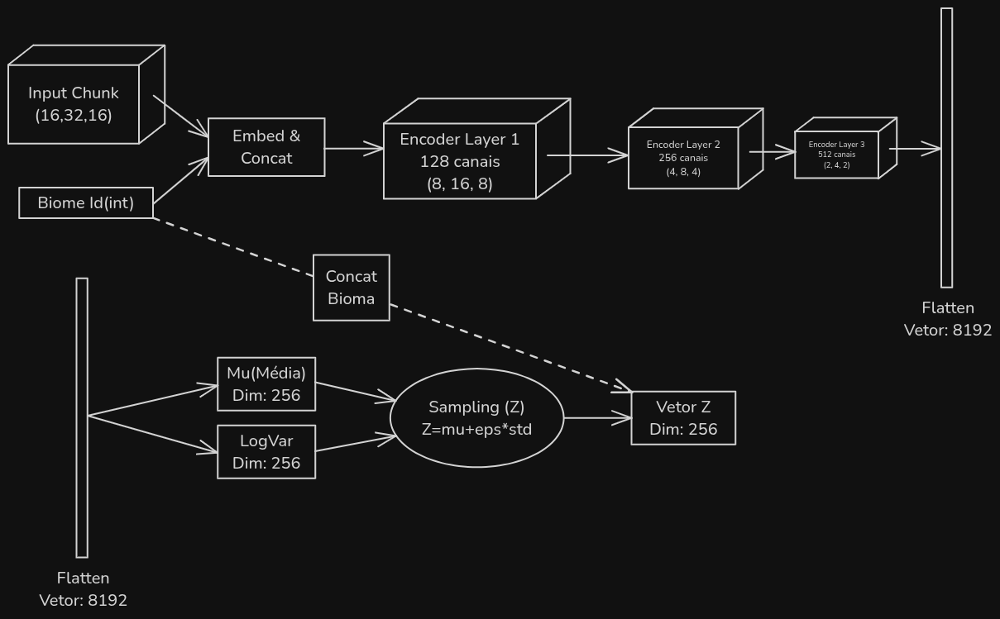
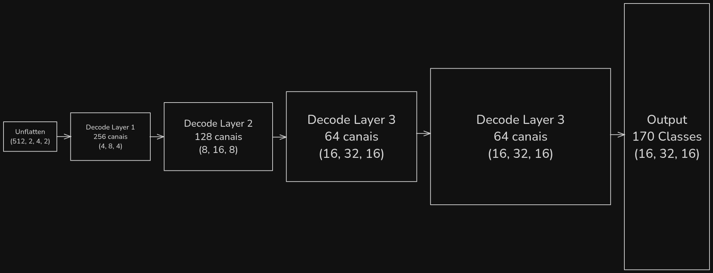

# Projeto final de IA Generativa

## Componentes

* Artur Revorêdo Pinto
* Beatriz Pegado

## Introdução

O projeto tem como objetivo treinar um __variational autoencoder__ a partir de __voxels__ que representam __chunks__ do jogo Minecraft no formato 16x32x16 para conseguir gerar novas instâncias de __chunk__.

## Como executar

Colete no [kaggle](https://www.kaggle.com/datasets/zwniff/mc-chunks) o arquivo ``minecraft_voxel_dataset.npz``, adicione esse arquivo na pasta data e rode o script ``pre_process.py`` com o uv:
```bash
# mkdir para garantir criação de pastas
mkdir -p models
mkdir -p media
uv run pre_process.py
```

Se você fez tudo certo até agora, você tem um arquivo ``prcessed_dataset.pt``, agora é possível treinar o modelo com o comando a seguir:
```bash
uv run train.py
``` 

Depois do modelo treinado, podemos gerar samples novas de chunk, para isso basta rodar o código:
```bash
uv run generate_samples.py
```

Agora você tem samples geradas

## Arquitetura

O modelo implementado é um VAE (Variational Autoencoder) condicional, projetado para gerar chunks 3D de Minecraft com base em condições específicas, como o bioma. A arquitetura é composta pelas seguintes partes principais:

### Encoder
O encoder é responsável por comprimir os dados de entrada (chunks e biomas) em um vetor latente de dimensão fixa. Ele utiliza:
- Camadas convolucionais 3D para extrair características espaciais.
- Embeddings para representar blocos e biomas como vetores densos.
- Camadas lineares para calcular os parâmetros da distribuição latente (média e log-variância).



### Decoder
O decoder reconstrói os chunks a partir do vetor latente e das condições fornecidas. Ele utiliza:
- Camadas deconvolucionais 3D para gerar os dados espaciais.
- Embeddings para incorporar as condições (biomas) no processo de geração.



### Pontos Fortes
- **Flexibilidade**: A inclusão de condições (como biomas) permite controlar a geração de chunks.
- **Capacidade de Generalização**: O uso de embeddings e convoluções 3D ajuda o modelo a capturar padrões espaciais complexos.
- **Regularização**: A divergência KL evita overfitting ao regularizar o espaço latente.

### Pontos Fracos
- **Custo Computacional**: Redes convolucionais 3D e o cálculo da perda podem ser computacionalmente caros.
- **Qualidade da Reconstrução**: A reconstrução pode ser limitada pela capacidade do vetor latente de capturar toda a informação relevante.
- **Treinamento Sensível**: O equilíbrio entre os termos da perda (reconstrução e KL) pode ser difícil de ajustar..

## Visualização de Resultados

Para a visualização das *samples* de chunks geradas no mundo do Minecraft, será utilizada a biblioteca **bedrockpy**, que permite a comunicação direta entre um script Python e o **Minecraft Bedrock Edition** via WebSocket.

### Preparação do ambiente

1. **Instale as dependências necessárias**, incluindo a biblioteca `bedrockpy`.
2. Mova todas as *samples* geradas pelo `generate_samples.py` para a pasta: loader/chunks
3. Abra o **Minecraft Bedrock Edition**.
4. Desative a opção de `Websockets Criptografados` nas configurações gerais.
5. Crie um mundo do tipo **void** (mundo vazio).  
6. Com o mundo aberto, execute o script: `plot_minecraft.py`

### Conexão com o Minecraft
Dentro do **chat do Minecraft**, realize a conexão com o servidor local executando o comando: 
```bash
/connect 127.0.0.1:6464
```

Se a conexão for bem-sucedida, o ambiente estará pronto para receber os comandos de visualização.

### Comandos disponíveis

Após a conexão, os seguintes comandos poderão ser utilizados diretamente no chat do Minecraft:

- `.start`  
  Realiza todas as inicializações necessárias para o funcionamento do sistema.

- `.load`  
  Carrega o arquivo `sample_01` (comportamento padrão) no mundo.

- `.load sample_name.txt`  
  Carrega o arquivo uma única sample da pasta loader/chunks no mundo.

- `.load.multiplos n`  
  Carrega **n samples** geradas no mundo, espaçadas entre si.

- `.clean`  
  Remove o **primeiro chunk** carregado.

- `.clean n`  
  Remove **n chunks** previamente carregados.

### Observações importantes

- Caso muitos chunks sejam carregados de uma vez, pode ser necessário se mover pelo mundo para forçar o *render* das estruturas durante o carregamento dos chunks.
- Utilizar um mundo do tipo **void** garante melhor controle visual e evita interferência de terrenos naturais.
