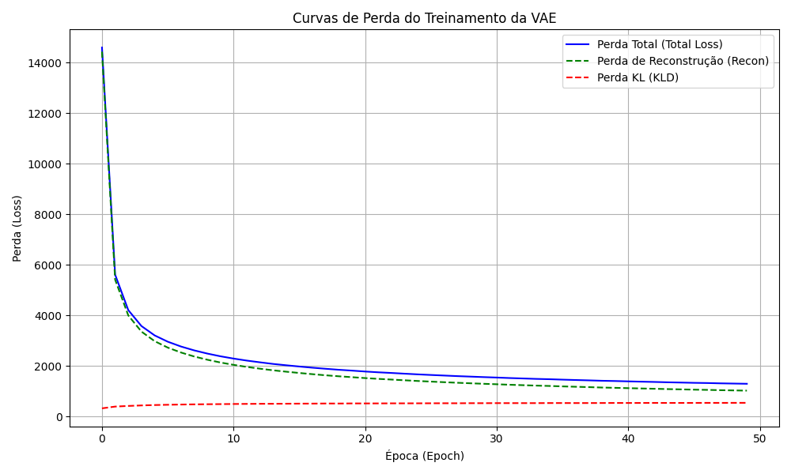
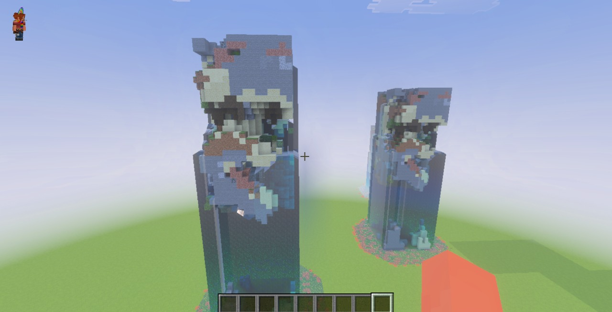
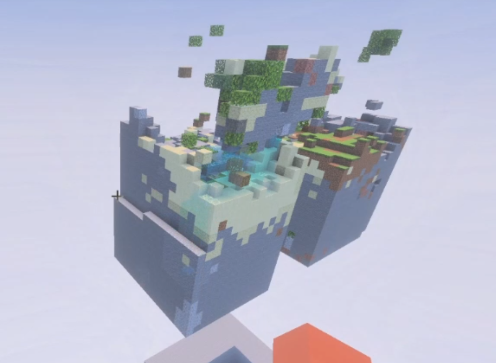

# Projeto final de IA Generativa

## Componentes

* Artur Revorêdo Pinto
* Beatriz Pegado

## Introdução

O projeto tem como objetivo treinar um __variational autoencoder__ a partir de __voxels__ que representam __chunks__ do jogo Minecraft no formato 16x32x16 para conseguir gerar novas instâncias de __chunk__. No treinamento e geração é utilizada uma condição que define o bioma de cada chunk, para permitir geração condicional.

## Como executar

Colete no [kaggle](https://www.kaggle.com/datasets/zwniff/mc-chunks) o arquivo ``minecraft_voxel_dataset.npz``, adicione esse arquivo na pasta data e rode o script ``pre_process.py`` com o uv:
```bash
# mkdir para garantir criação de pastas
mkdir -p models
mkdir -p media
uv run pre_process.py
```

Se você fez tudo certo até agora, você tem um arquivo ``prcessed_dataset.pt``, agora é possível treinar o modelo com o comando a seguir:
```bash
uv run train.py
``` 

Depois do modelo treinado, podemos gerar samples novas de chunk, para isso basta rodar o código:
```bash
uv run generate_samples.py
```

## Visualização de Resultados

Para a visualização das *samples* de chunks geradas no mundo do Minecraft, será utilizada a biblioteca **bedrockpy**, que permite a comunicação direta entre um script Python e o **Minecraft Bedrock Edition** via WebSocket.

### Preparação do ambiente

1. **Instale as dependências necessárias**, incluindo a biblioteca `bedrockpy`.
2. Mova todas as *samples* geradas pelo `generate_samples.py` para a pasta: loader/chunks
3. Abra o **Minecraft Bedrock Edition**.
4. Desative a opção de `Websockets Criptografados` nas configurações gerais.
5. Crie um mundo do tipo **void** (mundo vazio).  
6. Com o mundo aberto, execute o script: `plot_minecraft.py`

### Conexão com o Minecraft
Dentro do **chat do Minecraft**, realize a conexão com o servidor local executando o comando: 
```bash
/connect 127.0.0.1:6464
```

Se a conexão for bem-sucedida, o ambiente estará pronto para receber os comandos de visualização.

### Comandos disponíveis

Após a conexão, os seguintes comandos poderão ser utilizados diretamente no chat do Minecraft:

- `.start`  
  Realiza todas as inicializações necessárias para o funcionamento do sistema.

- `.load`  
  Carrega o arquivo `sample_01` (comportamento padrão) no mundo.

- `.load sample_name.txt`  
  Carrega o arquivo uma única sample da pasta loader/chunks no mundo.

- `.load.multiplos n`  
  Carrega **n samples** geradas no mundo, espaçadas entre si.

- `.clean`  
  Remove o **primeiro chunk** carregado.

- `.clean n`  
  Remove **n chunks** previamente carregados.

### Observações importantes

- Caso muitos chunks sejam carregados de uma vez, pode ser necessário se mover pelo mundo para forçar o *render* das estruturas durante o carregamento dos chunks.
- Utilizar um mundo do tipo **void** garante melhor controle visual e evita interferência de terrenos naturais.


## Arquitetura

O modelo implementado é um **VAE Condicional** (Variational Autoencoder), projetado para gerar chunks 3D de Minecraft com base em condições específicas, como o bioma. A arquitetura é composta por:

### Encoder
- **Função**: Comprimir os dados de entrada (chunks e biomas) em um vetor latente.
- **Componentes**:
  - Camadas convolucionais 3D para extrair características espaciais.
  - Embeddings para representar blocos e biomas como vetores densos.
  - Camadas lineares para calcular os parâmetros da distribuição latente (média e log-variância).

### Decoder
- **Função**: Reconstruir os chunks a partir do vetor latente e das condições fornecidas.
- **Componentes**:
  - Camadas deconvolucionais 3D para gerar os dados espaciais.
  - Embeddings para incorporar as condições (biomas) no processo de geração.

### Pontos Fortes e Fracos
- **Pontos Fortes**:
  - Flexibilidade no controle da geração via condições.
  - Captura de padrões espaciais complexos com convoluções 3D.
  - Regularização do espaço latente via divergência KL.
- **Pontos Fracos**:
  - Alto custo computacional.
  - Reconstrução limitada pela capacidade do vetor latente.
  - Sensibilidade ao ajuste dos termos da perda.

## Treinamento

O treinamento do modelo foi realizado com o dataset de chunks de Minecraft, utilizando uma perda composta por:

1. **Perda de Reconstrução**: Mede a diferença entre os chunks reais e os reconstruídos.
2. **Divergência KL**: Regulariza o espaço latente para seguir uma distribuição normal padrão.

### Desafios e Soluções
- **Repetição de Chunks**: Inicialmente, todas as chunks geradas eram idênticas. 
  - **Solução**: Ajuste na inicialização dos pesos e na regularização do espaço latente.
- **Vazamento de Água**: Problema resolvido com a adição de barreiras invisíveis do Minecraft para isolar cada chunk gerada.

Abaixo está a curva de perda do treinamento, mostrando a evolução da perda total, da perda de reconstrução e da divergência KL ao longo das épocas:



O modelo final foi salvo após atingir a melhor perda total observada.

## Resultados

### Teste Inicial
- **Problema**: Todas as chunks geradas eram idênticas.
- **Correção**: Ajustes na inicialização e regularização.



### Teste Final
- **Melhoria**: Geração de chunks únicas e isoladas com barreiras invisíveis.

